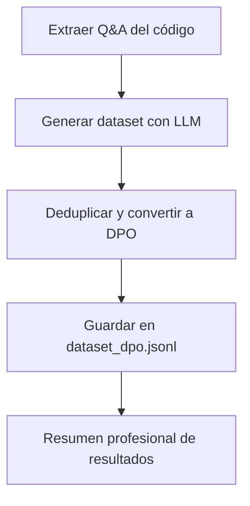

# Generación automática de datasets en formato Azure OpenAI DPO

Este módulo permite la generación, deduplicación y conversión de datasets al formato Azure OpenAI DPO, facilitando la preparación de datos para modelos de preferencias directas (Direct Preference Optimization).

## Flujo de trabajo



## Scripts principales

- `generate_dataset.py`: Automatiza la extracción de pares pregunta-respuesta y genera el dataset en formato DPO.
- `generar_dpo_dataset.py`: Deduplica y convierte datasets existentes al formato DPO.

## Formato de salida DPO

Cada ejemplo contiene:
```json
{
  "input": { "messages": [...] },
  "preferred_output": "...",
  "non_preferred_output": "..."
}
```

## Mensaje de salida

Al finalizar la generación, se muestra un resumen con el nombre del archivo, ruta, número total de ejemplos y formato utilizado.

## Uso recomendado

1. Ejecuta `generate_dataset.py` para extraer y generar el dataset inicial en formato DPO.
2. Si tienes datasets previos, usa `generar_dpo_dataset.py` para deduplicar y convertirlos al formato correcto.
3. Revisa el archivo `dataset_dpo.jsonl` para validar la estructura y los resultados.

## Ejemplo de ejecución

```bash
python generate_dataset.py
```

## Recomendaciones

- Asegúrate de que los datos fuente estén correctamente estructurados para maximizar la calidad del dataset.
- Valida el formato final antes de usarlo en modelos Azure OpenAI.
- Consulta la documentación de cada script para opciones avanzadas.
