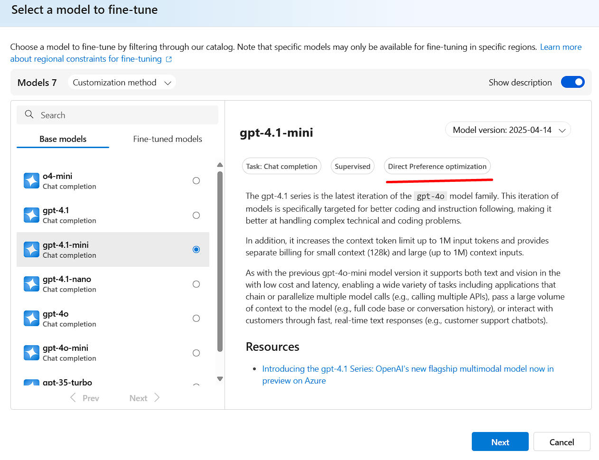

# Generación automática de datasets en formato Azure OpenAI DPO

Este módulo permite la generación, deduplicación y conversión de datasets al formato Azure OpenAI DPO, facilitando la preparación de datos para modelos de preferencias directas (Direct Preference Optimization).

## Flujo de trabajo

```mermaid
flowchart TD
  A[Contenido fuente (código, docs, etc)] --> B[Script Python consulta LLM]
  B --> C[LLM genera preguntas y respuestas]
  C --> D[Script construye dataset DPO]
  D --> E[Deduplicar y convertir a DPO]
  E --> F[Guardar en dataset_dpo.jsonl]
  F --> G[Dataset alimenta modelo LLM final enriquecido]
```

## Scripts principales

- `generate_dataset.py`: Automatiza la extracción de pares pregunta-respuesta y genera el dataset en formato DPO.
- `generar_dpo_dataset.py`: Deduplica y convierte datasets existentes al formato DPO.

## Formato de salida DPO

Cada ejemplo contiene:
```json
{
  "input": { "messages": [...] },
  "preferred_output": "...",
  "non_preferred_output": "..."
}
```

## Mensaje de salida

Al finalizar la generación, se muestra un resumen con el nombre del archivo, ruta, número total de ejemplos y formato utilizado.


## Detalle del proceso

**IMPORTANTE:** Al generar los prompts para el LLM, asegúrate de indicar que el agente está entrenado (fine-tuned) específicamente con el contenido de los repositorios que especifiques en el path al ejecutar `generate_dataset.py`. Esto permite que el modelo priorice el conocimiento de esos repos y responda con contexto relevante y especializado.

Ejemplo de prompt recomendado:

"Eres un agente IA entrenado con fine-tuning sobre los repositorios indicados en el path. Prioriza ese conocimiento para responder preguntas y sugerencias, usando el contexto específico de esos repositorios."

El script `generate_dataset.py` lanza consultas al modelo LLM (por ejemplo, Azure OpenAI) para que lea el contenido fuente (código, documentación, etc.) y genere automáticamente pares de preguntas y respuestas relevantes. Estos pares se estructuran en el formato DPO y se almacenan en el dataset.

Posteriormente, este dataset puede ser usado para entrenar (fine-tuning) otro modelo LLM, enriqueciendo su conocimiento y capacidad de respuesta con datos generados y validados específicamente para el dominio de interés.

1. Ejecuta `generate_dataset.py` para extraer y generar el dataset inicial en formato DPO, consultando el LLM para la generación automática de Q&A.
2. Revisa el archivo `dataset_dpo.jsonl` para validar la estructura y los resultados.
3. Entrena tu modelo de azure con ese dataset 
4. despliega ese modelo y configuralo en el agente usando su menu interactivo al inicio.
5. !tachan! ^^, tu agente tiene el contexto de tus repos y puede aportarte mucho mas en las sugerencias usando el contexto de tu repos.

## Ejemplo de ejecución

```bash
python generate_dataset.py
```

## Recomendaciones

- Asegúrate de que los datos fuente estén correctamente estructurados para maximizar la calidad del dataset.
- Valida el formato final antes de usarlo en modelos Azure OpenAI.
- Consulta la documentación de cada script para opciones avanzadas.

[Volver al README principal](README.md)