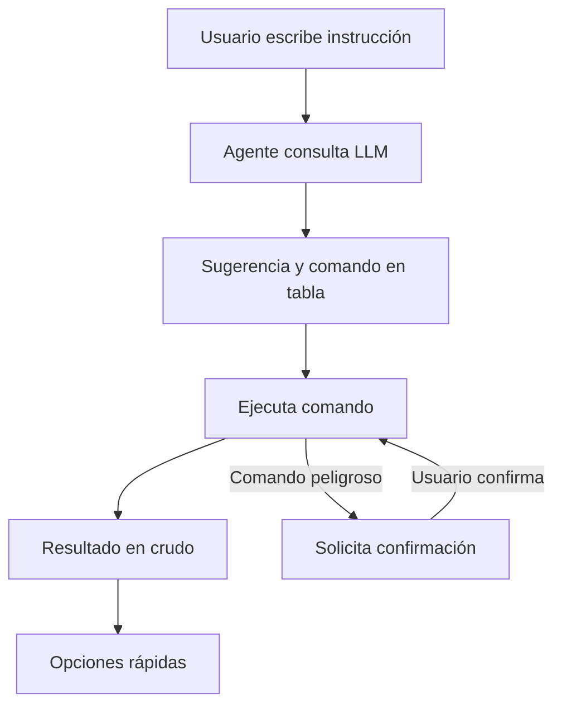
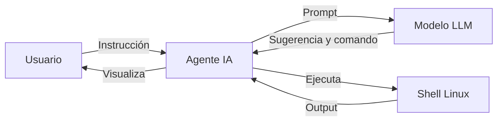

# 🧠 Agente IA para Linux

## Descripción

Este agente es una herramienta inteligente que interpreta instrucciones en lenguaje natural y ejecuta comandos en sistemas Linux. Utiliza un modelo LLM para sugerir el comando más adecuado, lo ejecuta de forma segura y muestra el resultado en formato profesional:

- **Sugerencia y encabezado**: Se muestran en tablas ASCII con colores y títulos centrados.
- **Resultado del comando**: Se muestra en crudo, respetando el formato original del output.
- **Opciones rápidas**: Siempre visibles al final para facilitar la interacción.
- **Confirmación**: Solicita confirmación para comandos delicados que puedan modificar el sistema.
- **Memoria de contexto**: Guarda resultados relevantes para mejorar futuras respuestas.

## Ejemplo de flujo



## Ejemplo visual

```
+---------------------------------------------------------------+
|                   SUGERENCIA DEL LLM                         |
+---------------------------------------------------------------+
| Mostrar servidores DNS del sistema                            |
|  Comando sugerido:                                            |
| cat /etc/resolv.conf                                          |
+---------------------------------------------------------------+
+---------------------------------------------------------------+
|                 RESULTADO DEL COMANDO                         |
+---------------------------------------------------------------+
# Output crudo aquí
+---------------------------------------------------------------+
[Opciones rápidas] sistema | cpu | memoria | disco | red | procesos | usuarios | servicio <nombre> | dns | salir
```

## Instalación y uso

1. Clona el repositorio en tu máquina Linux:
   ```bash
   git clone <URL-del-repo>
   cd agente
   pip install -r requirements.txt
   ```
2. Ejecuta el agente:
   ```bash
   python agent.py
   ```
3. Escribe instrucciones naturales, por ejemplo:
   - "Ver la memoria RAM"
   - "Estado de la red"
   - "Mostrar usuarios conectados"

## Seguridad
- El agente detecta comandos peligrosos y solicita confirmación antes de ejecutarlos.
- El output se muestra siempre en formato profesional y legible.

## Diagrama de arquitectura



## Autor
- DXC / MAPFRE

## Licencia
MIT
