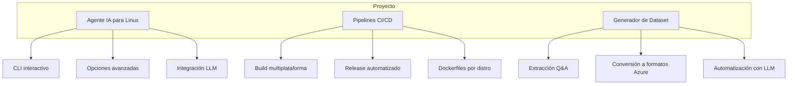

- [Historial de releases y binarios generados](README-releases.md)

# 🧠 Proyecto Agente IA Linux

Este proyecto tiene **tres líneas principales de trabajo**:

---



---

## Líneas principales

1. **Agente IA para Linux**
	- CLI interactivo y seguro
	- Ejecución de comandos y diagnósticos
	- Integración con LLM (Azure OpenAI)
	- Configuración persistente y portable

2. **Pipelines CI/CD**
	- Workflows para compilar binarios por distro
	- Publicación automática en GitHub Releases
	- Dockerfiles y scripts para builds reproducibles

3. **Generador de Dataset**
	- Extracción automática de Q&A desde repositorios
	- Conversión a formatos compatibles con Azure OpenAI (Direct Preference)
	- Automatización y limpieza de datos

---

## Documentación y enlaces

- [Binario portable y uso remoto](README-binario.md)
- [Pipeline CI/CD y releases](README-pipeline.md)
- [Estructura del repositorio](README-estructura.md)
- [Historial de releases y binarios generados](README-releases.md)

---

## Instalación rápida (binario portable)

**Descarga el binario desde [GitHub Releases](https://github.com/v4mpir0ck/agent-linux/releases/latest) según tu distribución:**

### Fedora / RHEL / UBI
```bash
curl -L -o agent "https://github.com/v4mpir0ck/agent-linux/releases/latest/download/agent-Dockerfile.ubi8"
chmod +x agent
./agent
```

### Ubuntu
```bash
curl -L -o agent "https://github.com/v4mpir0ck/agent-linux/releases/latest/download/agent-Dockerfile.ubuntu"
chmod +x agent
./agent
```

---

## Autor y licencia
- Javier Lazaro
- MIT
