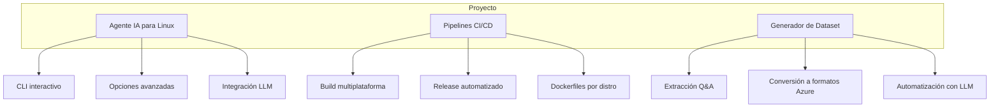

- [Historial de releases y binarios generados](README-releases.md)

# 🧠 Proyecto Agente IA Linux

## Índice

- [Líneas principales](#líneas-principales)
- [Generación automática de datasets en formato Azure OpenAI DPO](#generación-automática-de-datasets-en-formato-azure-openai-dpo)
- [Documentación y enlaces](#documentación-y-enlaces)
- [Instalación rápida (binario portable)](#instalación-rápida-binario-portable)
- [Autor y licencia](#autor-y-licencia)

Este proyecto tiene **tres líneas principales de trabajo**:

---


```mermaid
graph TD
	 A[Agente IA para Linux] --> B[CLI interactivo]
	 A --> C[Opciones avanzadas]
	 A --> D[Integración LLM]
	 E[Pipelines CI/CD] --> F[Build multiplataforma]
	 E --> G[Release automatizado]
	 E --> H[Dockerfiles por distro]
	 I[Generador de Dataset] --> J[Extracción Q&A]
	 I --> K[Conversión a formatos Azure]
	 I --> L[Automatización con LLM]
	 subgraph Proyecto
		  A
		  E
		  I
	 end
```

---

## Líneas principales

1. **Agente IA para Linux**
	- CLI interactivo y seguro
	- Ejecución de comandos y diagnósticos
	- Integración con LLM (Azure OpenAI)
	- Configuración persistente y portable

2. **Pipelines CI/CD**
	- Workflows para compilar binarios por distro
	- Publicación automática en GitHub Releases
	- Dockerfiles y scripts para builds reproducibles

3. **Generador de Dataset personalizado**
	- Extracción automática de Q&A desde repositorios
	- Conversión a formatos compatibles con Azure OpenAI (Direct Preference)
	- Automatización y limpieza de datos

## Documentación y enlaces

- [Binario portable y uso remoto](README-binario.md)
- [Pipeline CI/CD y releases](README-pipeline.md)
- [Generador de Dataset personalizado](README-generate-dataset.md)
- [Instalación del agente IA](README-instalar_agente.md)
---

## Instalación rápida (binario portable)

El agente incluye binarios portables de herramientas de red (`nmap`, `netstat`, `lsof`, `ss`, `tcpdump`) para cada distribución soportada. El instalador detecta tu sistema y despliega automáticamente estos binarios junto al agente, garantizando funcionamiento sin dependencias externas. Si no se encuentran binarios para tu distro, se usarán los del sistema o deberás instalarlos manualmente.

**Descarga el binario desde [GitHub Releases](https://github.com/v4mpir0ck/agent-linux/releases/latest) según tu distribución:**

### Fedora / RHEL / UBI
```bash
curl -L -o agent "https://github.com/v4mpir0ck/agent-linux/releases/latest/download/agent-Dockerfile.ubi8"
chmod +x agent
./agent
```

### Ubuntu
```bash
curl -L -o agent "https://github.com/v4mpir0ck/agent-linux/releases/latest/download/agent-Dockerfile.ubuntu"
chmod +x agent
./agent
```

---

## Requisitos de configuración para el agente IA

Para que el agente funcione correctamente, es necesario:

1. Tener un modelo de Azure OpenAI desplegado en tu suscripción (por ejemplo, GPT-4, GPT-3.5, etc).
2. Proporcionar los valores de configuración al agente al arrancar:
	- **AZURE_OPENAI_ENDPOINT**: URL del endpoint de tu modelo desplegado.
	- **AZURE_OPENAI_KEY**: Clave de acceso a la API.
	- **AZURE_OPENAI_DEPLOYMENT**: Nombre del deployment/modelo configurado.

Puedes pasar estos valores como variables de entorno, en un archivo `.env`, o directamente en la configuración del agente.

Sin estos datos, el agente no podrá conectarse al modelo y no funcionará correctamente.

## Autor y licencia
- Javier Lazaro
- MIT
