# 🧠 Agente IA para Linux

## Descripción

Este agente es una herramienta inteligente que interpreta instrucciones en lenguaje natural y ejecuta comandos en sistemas Linux. Utiliza un modelo LLM para sugerir el comando más adecuado, lo ejecuta de forma segura y muestra el resultado en formato profesional:

- **Sugerencia y encabezado**: Se muestran en tablas ASCII con colores y títulos centrados.
- **Resultado del comando**: Se muestra en crudo, respetando el formato original del output.
- **Opciones rápidas**: Siempre visibles al final para facilitar la interacción.
- **Confirmación**: Solicita confirmación para comandos delicados que puedan modificar el sistema.
- **Memoria de contexto**: Guarda resultados relevantes para mejorar futuras respuestas.

## Ejemplo de flujo

```mermaid
graph TD
    A[Usuario escribe instrucción] --> B[Agente consulta LLM]
    B --> C[Sugerencia y comando en tabla]
    C --> D[Ejecuta comando]
    D --> E[Resultado en crudo]
    E --> F[Opciones rápidas]
    D -->|Comando peligroso| G[Solicita confirmación]
    G -->|Usuario confirma| D
```



## Ejemplo visual

```
+---------------------------------------------------------------+
|                   SUGERENCIA DEL LLM                         |
+---------------------------------------------------------------+
| Mostrar servidores DNS del sistema                            |
|  Comando sugerido:                                            |
| cat /etc/resolv.conf                                          |
+---------------------------------------------------------------+
+---------------------------------------------------------------+
|                 RESULTADO DEL COMANDO                         |
+---------------------------------------------------------------+
# Output crudo aquí
+---------------------------------------------------------------+
[Opciones rápidas] sistema | cpu | memoria | disco | red | procesos | usuarios | servicio <nombre> | dns | salir
```

## Instalación y uso

### 1. Clona el repositorio
```bash
git clone <URL-del-repo>
cd agente
```


### 2. Instalación de dependencias (offline/online)

**Opción rápida (Linux/WSL):**
```bash
./instalar_agente.sh
```

**Opción multiplataforma (Windows/Linux):**
```bash
python instalar_agente.py
# o
python install_requirements.py
```

Esto instalará automáticamente las dependencias desde PyPI si hay Internet, o desde la carpeta `wheels/` si estás offline.

> **Para preparar la carpeta wheels/ (solo la primera vez, en un entorno con Internet):**
> ```bash
> pip download -r requirements.txt -d wheels
> ```

### 3. Configura el token seguro de Azure OpenAI (solo si usas LLM Azure)

Ejecuta:
```bash
python encrypt_token.py
```
Sigue las instrucciones para encriptar tu token y protegerlo con passphrase. El archivo `azure_openai_token.enc` se usará automáticamente.

### 4. Ejecuta el agente
```bash
python agent.py
```

### 5. Escribe instrucciones naturales, por ejemplo:
- "Ver la memoria RAM"
- "Estado de la red"
- "Mostrar usuarios conectados"

## Seguridad y portabilidad
- El agente detecta comandos peligrosos y solicita confirmación antes de ejecutarlos.
- El output se muestra siempre en formato profesional y legible.
- El token de Azure OpenAI se almacena encriptado y solo se desencripta en memoria.
- Instalación 100% offline posible si tienes la carpeta `wheels/` poblada.

## Diagrama de arquitectura

```mermaid
flowchart LR
    User[Usuario] -->|Instrucción| Agent[Agente IA]
    Agent -->|Prompt| LLM[Modelo LLM]
    LLM -->|Sugerencia y comando| Agent
    Agent -->|Ejecuta| Linux[Shell Linux]
    Linux -->|Output| Agent
    Agent -->|Visualiza| User
```



## Scripts clave

- `instalar_agente.py`: Instalador universal (offline/online) de dependencias.
- `install_requirements.py`: Alternativa de instalador (offline/online).
- `encrypt_token.py`: Encriptador de token Azure OpenAI.
- `llm_client.py`: Cliente seguro para LLM Azure OpenAI.
- `agent.py`: Agente principal, CLI interactivo.

## Autor
- Javier Lazaro 

## Licencia
MIT
